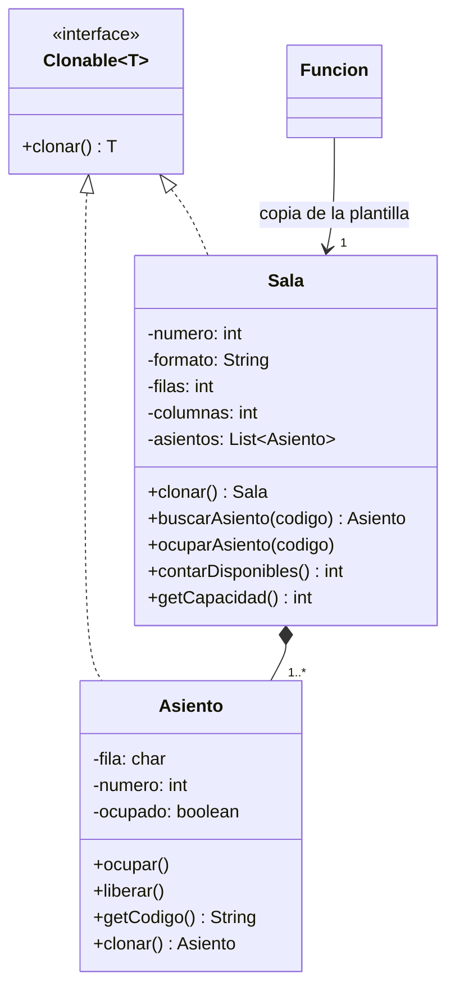

# Patrón Prototype — Sala

**Responsable:** Juan Carlos Polanía · **Entrega 1**

## 1. Problema
Varias funciones se proyectan en la misma sala, a distintas horas. Todas comparten la misma distribución de asientos (filas A–H, columnas 1–12, por ejemplo), pero cada función necesita su propia disponibilidad: si se vende el D4 para la función de las 7:00 p. m., ese asiento debe seguir libre para la de las 9:00 p. m.

Regla RN-002: *un mismo asiento no puede venderse dos veces para una misma función.*

## 2. Patrón
**Prototype** (creacional): se crea un objeto nuevo copiando uno existente que sirve de modelo, en lugar de construirlo desde cero.

## 3. Justificación
- La sala registrada por el administrador es la **plantilla**. Para cada función se usa `sala.clonar()` y se obtiene una sala con los mismos asientos, pero independiente.
- La copia es **profunda**: se clona cada `Asiento`. Con una copia superficial, la plantilla y la copia compartirían los mismos objetos `Asiento`, y ocupar uno lo ocuparía en todas las funciones.
- Se usa una interfaz propia `Clonable<T>` en lugar de `java.lang.Cloneable`, porque `Cloneable` no declara métodos, depende de `Object.clone()` (copia superficial y excepción verificada) y no devuelve el tipo correcto.

## 4. Clases
| Clase | Rol |
|---|---|
| `Clonable<T>` | Interfaz del prototipo: `T clonar()` |
| `Sala` | Prototipo concreto. Genera sus asientos y se copia a sí misma clonando cada asiento |
| `Asiento` | Prototipo concreto. Guarda fila, número y si está ocupado. `ocupar()` lanza error si ya estaba ocupado |
| `Funcion` | Cliente del patrón: recibe `plantilla.clonar()` en `conSala(...)` del Builder |

## 5. Diagrama

También aparece en `docs/Diagrama de clases Entrega 1.drawio`.

## 6. Evidencia
Pruebas en `src/test/java/com/example/cinemauq/model/SalaPrototypeTest.java`:

| Prueba | Qué demuestra |
|---|---|
| `elClonEsUnaCopiaProfunda` | La copia no comparte ningún objeto `Asiento` con la plantilla |
| `ocuparEnUnaFuncionNoAfectaOtraFuncionDeLaMismaSala` | El D4 ocupado en una función sigue libre en otra |
| `ocuparDosVecesElMismoAsientoLanzaError` | Caso CP-02 (RN-002): el D4 vendido dos veces en la misma función da error |
| `capacidadYDisponibles` | Sala 8×12 = 96 asientos; al ocupar 2 quedan 94 |
| `cadaFuncionRecibeSuPropiaCopiaDeLaSala` | Uso real con el Builder de `Funcion` |

Cómo correrlas: en IntelliJ, clic derecho sobre `SalaPrototypeTest` → *Run*.

**Ejemplo de uso:**
```java
Sala sala1 = new Sala(1, "2D", 8, 12);          // plantilla
Funcion f19 = new Funcion.Builder()
        .conSala(sala1.clonar())                 // copia propia para esta función
        /* ...resto de datos... */
        .build();
```
