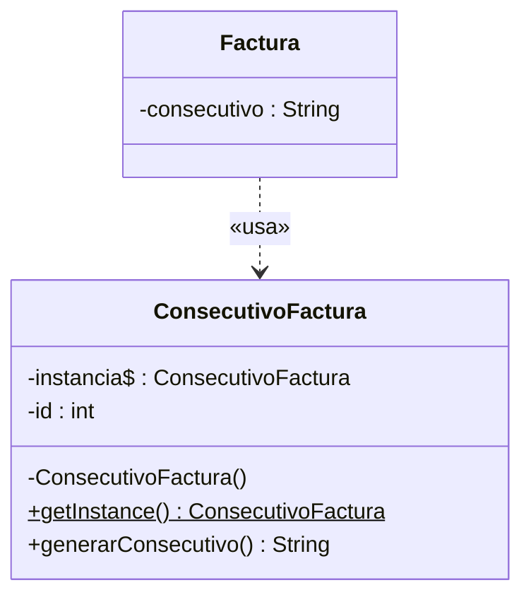

# Patrón Singleton — ConsecutivoFactura

**Responsable:** Juan Diego Quitián · **Entrega 1**

## 1. Problema
Cada compra confirmada genera una factura con un consecutivo, y ese consecutivo no puede repetirse (RN-014). Si varias partes del sistema crearan su propio generador con `new`, cada uno empezaría a contar desde 1 y saldrían facturas repetidas.

## 2. Patrón
**Singleton** (creacional): garantiza que una clase tenga **una sola instancia** y ofrece un punto de acceso global a ella.

## 3. Justificación
- El contador de facturas es un recurso único del negocio. Todas las compras deben consumir la misma secuencia.
- El constructor es **privado**: nadie fuera de la clase puede hacer `new ConsecutivoFactura()`.
- El método estático `getInstance()` crea la instancia la primera vez que se pide y la devuelve en las siguientes (*lazy initialization*, creación perezosa).
- `generarConsecutivo()` devuelve el número con formato `FAC-000001` e incrementa el contador.

**Limitación conocida (pregunta probable en la sustentación):** la implementación no es segura con varios hilos. Si dos hilos llaman a `getInstance()` al mismo tiempo, podrían crearse dos instancias. En una aplicación JavaFX de escritorio la lógica corre en un solo hilo, así que no ocurre. Si se necesitara, se resuelve con `synchronized` o con el *holder idiom* (una clase interna estática que guarda la instancia).

## 4. Clases
| Clase | Rol |
|---|---|
| `ConsecutivoFactura` | Singleton: atributo estático `instancia`, constructor privado, `getInstance()` y `generarConsecutivo()` |
| `Factura` (diseñada, por implementar) | Cliente del patrón: pedirá su consecutivo a `ConsecutivoFactura.getInstance()` |

## 5. Diagrama

También aparece en `docs/Diagrama de clases Entrega 1.drawio`.

## 6. Evidencia
Código: `src/main/java/com/example/cinemauq/model/ConsecutivoFactura.java`

Pruebas en `src/test/java/com/example/cinemauq/model/ConsecutivoFacturaTest.java`:

| Prueba | Qué demuestra |
|---|---|
| `siempreSeObtieneLaMismaInstancia` | Dos llamadas a `getInstance()` devuelven exactamente el mismo objeto |
| `cp11LosConsecutivosNoSeRepiten` | Caso CP-11: dos consecutivos seguidos son distintos y van en orden |

```java
String f1 = ConsecutivoFactura.getInstance().generarConsecutivo(); // FAC-000001
String f2 = ConsecutivoFactura.getInstance().generarConsecutivo(); // FAC-000002
```
